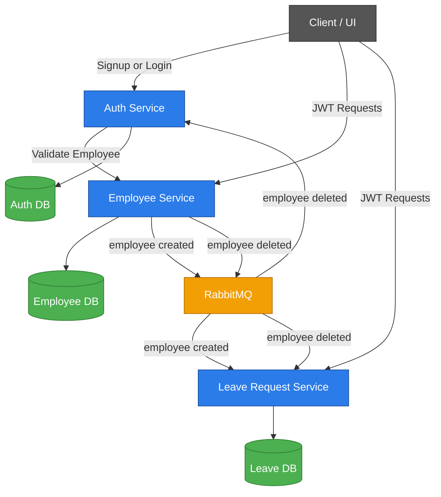

# 🟦 Leave Management System (LMS)


A complete end-to-end **microservices-based Leave Management System** built using **Core Java**, JDBC, lightweight HTTP servers, RabbitMQ-based event-driven communication, and JWT authentication.

This project was built to master **backend engineering**, **microservice design**, **asynchronous communication**, **security**, **database migrations**, and clean architecture — all without relying on frameworks like Spring Boot.

---

## 🚀 Why This Project Exists
This system was designed as a **real-world learning project** to practice:
- Microservice architecture
- Event-driven communication (RabbitMQ)
- Clean layered backend design
- Authentication & Authorization (JWT)
- Core Java HTTP server development
- JDBC + SQLite persistence with Flyway migrations
- Production-style API design and error handling

The goal is to develop the skills required for professional **backend Java development**.

---

## 🧩 Microservices Overview

This project consists of **three independent microservices**, each with its own database, handlers, DTOs, validations, authentication logic, and error management.

| Service | Description | Link |
|--------|-------------|------|
| **Auth Service** | Manages JWT tokens, authentication, and role validation (Employee, Manager, Admin). | [`auth-service/README.md`](./auth-service/README.md) |
| **Employee Service** | Handles employee CRUD, departments, event publishing, and internal APIs. | [`employee-service/README.md`](./employee-service/README.md) |
| **Leave Request Service** | Handles applying, approving, rejecting, cancelling leave, leave balances, audit logs, and consuming employee events. | [`leave-request-service/README.md`](./leave-request-service/README.md) |

---

## 🏛 Architecture Overview

### High-Level Flow


---

## 🔄 Inter-Service Communication

### 1️⃣ **Synchronous (HTTP)**  
- UI → Auth Service → issues JWT  
- UI → Employee Service (CRUD)  
- UI → Leave Request Service (apply/approve/reject)  
- Leave Request Service → Auth Service (JWT validation)

### 2️⃣ **Asynchronous (RabbitMQ Events)**  
- **EmployeeCreatedEvent → LeaveService**  
  Automatically creates leave balances.  
- **EmployeeDeletedEvent → LeaveService**  
  Automatically deletes leave balances.
- **EmployeeDeletedEvent → AuthService**  
  Automatically deletes user auth records.

Leave Request Service *only consumes events* (does not publish).

Auth Service *only consumes events* (does not publish).

---

## 🛠 Tech Stack (All Services)

| Component                       | Technology / Approach                                                                 |
|---------------------------------|--------------------------------------------------------------------------------------|
| **Language**                    | Java 21                                                                              |
| **Server**                      | `com.sun.net.httpserver.HttpServer` (lightweight embedded HTTP server)               |
| **Database**                    | SQLite (file-based relational DB, per service)                                       |
| **DB Migrations**               | Flyway (versioned SQL migrations per service)                                        |
| **Persistence Layer**           | JDBC + DAO pattern                                                                   |
| **JSON Processing**             | Jackson                                                                              |
| **Config Management**           | Dotenv                                                                               |
| **Security**                    | JWT-based authentication + internal service secret (`X-Service-Auth`)                |
| **Event Communication**         | RabbitMQ (EmployeeCreated / EmployeeDeleted events, consumed by Leave & Auth services) |
| **Event Consumption Modes**     | RabbitMQ auto-consumer with listener registry                                        |
| **Event Handlers**              | Automatic LeaveBalance creation/deletion on employee lifecycle events                |
| **Validation Layer**            | Centralized validator utilities (dates, overlaps, quotas, leave types, roles, etc.) |
| **Business Rules Engine**       | Leave accrual, overlap prevention, half-day validation, approval workflows          |
| **Response Formatting**         | Standardized `DTO_api_response` wrappers                                             |
| **Exception Handling**          | Centralized ExceptionMapperManager + specific exception mappers                      |
| **Service-to-Service Calls**    | Internal HTTP client wrapper (e.g., Employee Service lookup for Auth/Leave validation) |
| **Swagger / API Docs**          | OpenAPI YAML + embedded Swagger UI handler                                           |
| **Architecture**                | Microservices, clean modular layers, independent DB per service                      |

---

## 📁 Project Structure (Root)

```bash
# Leave Management System 

.
├── LICENSE                             # Project license
├── .gitignore                          # Git ignore for target, DB, IDE files, etc.
├── README.md                           # Main project README
├── auth-service                        # Handles authentication & authorization
│   ├── data                            # SQLite DB file
│   ├── src
│   │   ├── main
│   │   │   ├── java
│   │   │   └── resources
│   │   └── test
│   │       ├── java
│   │       └── resources
│   │── README.md                       # Service-specific README
│   │── .env.example
│   └── pom.xml
├── employee-service                    # Manages employee data and publishes events
│   ├── data
│   ├── docs                            # Service-specific documentation
│   ├── src
│   │   ├── main
│   │   │   ├── java
│   │   │   └── resources
│   │   └── test
│   │       ├── java
│   │       └── resources
│   │── README.md                      # Service-specific README
│   │── .env.example
│   └── pom.xml
│── leave-request-service              # Handles leave requests, approvals, and balances
│   ├── data
│   ├── src
│   │   ├── main
│   │   │   ├── java
│   │   │   └── resources
│   │   └── test
│   │       ├── java
│   │       └── resources
│   │── README.md                      # Service-specific README
│   │── .env.example
│   └── pom.xml
.
```

---

## 🧠 Overview of Each Service

### 🔐 Auth Service
- Generates JWT tokens  
- Validates roles: Employee, Manager, Admin  
- Provides internal service authentication (X-Service-Auth)  
- Stateless and lightweight  

👉 More details: [`auth-service/README.md`](./auth-service/README.md)

### 👥 Employee Service
- CRUD employee records  
- CRUD department  
- Input validation (email, role, department)  
- Publishes events to RabbitMQ  
- Supports HTTP and MQ event publish modes  

👉 More details: [`employee-service/README.md`](./employee-service/README.md)

### 🗓 Leave Request Service
- Apply, approve, cancel, reject leave  
- Handles leave balance creation and updates  
- Creates audit logs  
- Prevents overlapping leaves  
- Enforces half-day rules  
- Consumes employee events  
- Exposes manager/team access paths  

👉 More details: [`leave-request-service/README.md`](./leave-request-service/README.md)

---

## 🧪 Testing
- Tested through Postman collections  
- Validation tests for DTOs  
- Manual integration testing of RabbitMQ flow  

(Automated tests to be added in future.)

---

## 🛣 Roadmap
- v1: Core leave workflow ✔  
- v2: Containerization with Docker  
- v3: Frontend dashboard (React or Thymeleaf)  
- v4: Calendar sync (Google/Outlook) 
- v5: Notifications (email/Slack)
 

---

## 👨‍💻 Author
**Said Hisham**  
Backend Java Developer  
Passionate about Java, clean architecture, and microservices.

[GitHub](https://github.com/syedhisham41) | [LinkedIn](https://www.linkedin.com/in/syedhisham41/)

---

